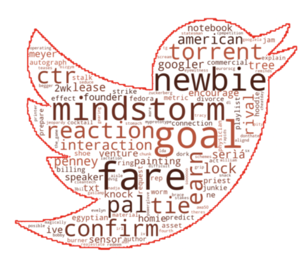

# Tweet Sentiment Analysis
Allison Gao, Meaghan Ross, Raylin Soriano

 <br />

## Overview
This analysis used over 9,000 tweets regarding the brands Apple and Google and their products to build a natural language processing (NLP) model to analyze consumer sentiment. 

## Business Problem
The purpose of the analysis is to provide actionable recommendations for a client seeking to purchase a consumer sentiment tool that is able to detect product sentiment based on tweets. Clients interested in detecting product sentiment for purposes of market segmentation can use this project’s findings to inform its business decision. 

## Data & Methodology

#### Data Source
The dataset comes from CrowdFlower via data.world found [here](https://data.world/crowdflower/brands-and-product-emotions).
The data was collected from twitter users attending the 2011 South by Southwest conferences and festivals.

#### Data Shape
The entire raw dataset contains 9094 rows and 3 columns. Each row represents a tweet while each column specifies a feature. The threee column are content of the tweet, what type of emotion was detected based on the Tweet, and what company the Tweet was directed at. Human raters rated the sentiment in over 9,000 Tweets as positive, negative, no emotion detected, or “I can’t tell”. 

This is a highly imbalanced dataset. Close to 60% of the tweets were labeled as no emotion, 32% were associated with positive emotion, 6% were associated with negative emotions, and 1.7% were labeled as “I can’t tell”. Given the small percentage of tweets labeled as unable to detect, we excluded these from our dataset, resulting in a three-class target variable. The three classes are positive emotion, negative emotion, and no emotion detect. 

## EDA

* This word cloud shows the unique words found from postive tweets from our data.

<br>
* This word cloud shows the unique words found from negative tweets from our data.

<br>

* This graph below shows the distribution of the length of both postive and negative tweets. Looking at the graph it shows that the length of the tweet does not impact on whether a tweet will be labeled as positive, negative or no emotion based on its length.

<br>


## Final Model
<br>
* Before modeling, the tweets were preprocessed. First, a TweetTokenizer was implemented to split the tweet text into words while keeping hashtags and handles intact. 
* Then the text was lowercased and stop words were removed. 
* In the last step of preprocessing the text was put through a lemmatization process to convert words to their base forms using their part of speech. 
* After performing a train-test split, the tweet text and the target were then loaded into a model pipeline that included a TF-IDF vectorizer, followed by SMOTE to slightly oversample the negative emotion class. 
* Finally, the data and their TF-IDF scores were put through a Multinomial Naive Bayes model to predict the sentiment of the original tweet.

#### Results
The final model has a **Accuracy Score of 66%** and a **Macro Precision Score of 70%**.

<br>


## Conclusion
* Per our business problem, we believe Samsung should implement the text preprocessing and model pipeline with Multinomial Bayes as it is the best overall model for taking in text from tweets and precisely categorizing the sentiment of the tweet.  
* Samsung could avoid using costly human coders in the process of sentiment analysis by using this model to correctly predict tweet sentiment.  

## Next Steps
* We would like to include deep-learning such as Word2Vec to help create more precise models. 

* Include the the tweets classified as "I can't tell" to better prepare prepare for unseen data.

## Project Structure
```
├── README.md
├── Individuals Notebooks       <--- Directory for individual workspaces
│   ├── allison
│   ├── meaghan
│   ├── raylin
│   
├── Presentation.pdf   
├── final.ipynb     
└── .gitignore
```
